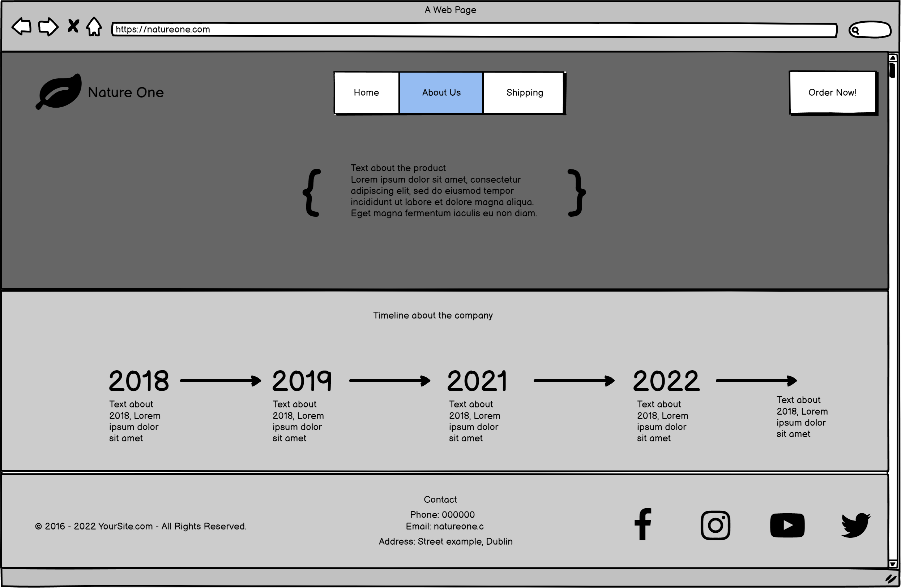
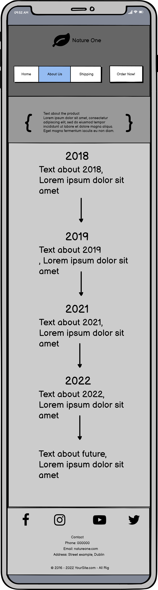
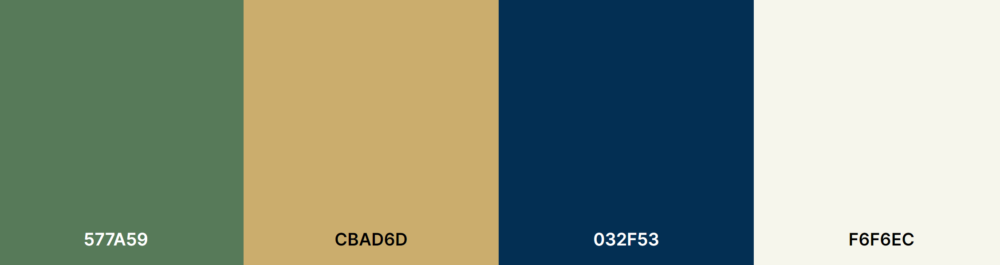

 
 ## Overview
 ___
 Nature one is a subscription based service for building a personalised multivitamin created from natural ingredients that is delivered to your door.

## Table of Contents
___
 1. [Overview](https://github.com/luciotorelli/nature-one#overview)
 2. [User Stories](https://github.com/luciotorelli/nature-one#user-stories)
 3. [Site Owner Goals](https://github.com/luciotorelli/nature-one#site-owner-goals)
 4. [Wireframes](https://github.com/luciotorelli/nature-one#wireframes)
 5. [Color Scheme and Typography](https://github.com/luciotorelli/nature-one#color-scheme-and-typography)
 6. [Features](https://github.com/luciotorelli/nature-one#features)
    * Features
    * Future Features
 7. Technologies used
 8. Testing
    * 7.1 Code validation
    * 7.2 Test cases (User Feedback - Screenshots)
    * 7.3 Fixed Bugs
    * 7.4 Supported Screens and Browsers
 9. Deployment
    * 8.1 Gitpod
    * 8.2 Github pages
 10.  Credits

 

 ## User Stories
 ___

 * Understand the business nature of the website on the first page.
 * Easily identify all existing pages within the website.
 * Quickly navigate to the order page for a seemless shopping experience. 
 * Access to critical information such as shipping, policies and about us from the header.  

 

 ## Site Owner Goals: 
  ___

 * Create a website for signing-up to a personalized multi-vitamin subscription service.
 * The website/business purpose is easily identifiable on the first page. 
 * The website is responsive and adaptable for Mobile, Desktop and in-between screens. 
 * The layout and design displays the sense of a natural and modern product. 

 

 ## Wireframing: 
  ___

   
Desktop

   
   *  

         
Home

            
      

   *  

         
Order Now

            
      

   *  

         
Shipping

            
      

   *  

         
About Us

            
      
            

   
Mobile

      
   *  

         
Home

            
      

   *  

         
Order Now

            
      

   *  

         
Shipping

            
      

   *  

         
About Us

            
      

 

## Color Scheme and Typography
  ___
 

1. ### Color Scheme
 

* #597D5B and it's neighboring shades are used on the header/hero image as well as on complementary images and footer. 
* #CBAD6D is used as an accent color for buttons and to highlight certain objects such as the multivitamin on the hero image.
* #F6F6EC is used as font color for dark backgrounds and as a primary background color for some sections on desktop screens. 
* #E7DCC0 is used as a secondary background color for some sections.

 

2. ### Typography

   [Open Sans](https://fonts.google.com/specimen/Open+Sans) was the choice for this project due to the flexibility, neutrality and friendly appearence. It helps the website to display well in any screen or font size while staying modern and appealing.  

## Features
  ___
 

* ### Features
   1. Landing Page - The landing page should provide the context on what is the website for, how to place an order and every page available. 
   2. The first section should be a breakdown of how the natural vitamins are created/harvested. 
   3. The second section provide the pros of hiring the service as well as a quick commercial about the company.
   4. The footer presents a copyright notice, contact information and social media links. 
   5. Secondary pages are split into two easily identifiable sections, header and footer. 
   6. The order now page presents a form for the user to place their order. 

* ### Future Features
   1. Blinking animation on the Order Now! button
   2. If required, create a new layout for medium screens such as tablets. 
   3. Implement Aria.
   4. Background color for form inputs