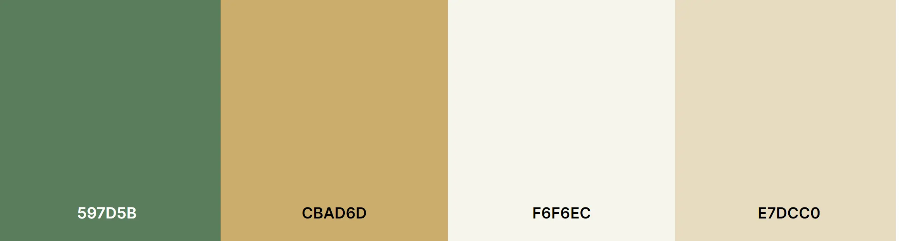

 
 ## Overview
 ___
 Nature one is a subscription based service for building a personalized multivitamin created from natural ingredients that is delivered to your door.

## Table of Contents
___
 1. [Overview](https://github.com/luciotorelli/nature-one#overview)
 2. [User Stories](https://github.com/luciotorelli/nature-one#user-stories)
 3. [Site Owner Goals](https://github.com/luciotorelli/nature-one#site-owner-goals)
 4. [Wireframes](https://github.com/luciotorelli/nature-one#wireframing)
 5. [Color Scheme and Typography](https://github.com/luciotorelli/nature-one#color-scheme-and-typography)
 6. [Features](https://github.com/luciotorelli/nature-one#features)
    * [Features](https://github.com/luciotorelli/nature-one#features-1)
    * [Future Features](https://github.com/luciotorelli/nature-one#future-features)
 7. [Technologies used](https://github.com/luciotorelli/nature-one#technologies-used)
 8. [Testing](https://github.com/luciotorelli/nature-one#testing)
    * 8.1 Code validation
    * 8.2 Test cases (User Feedback - Screenshots)
    * 8.3 Fixed Bugs
    * 8.4 Supported Screens and Browsers
 9. Deployment
    * 9.1 Gitpod
    * 9.2 Github pages
 10.  Credits

 

 ## User Stories
 ___

 * As a new user I would like to understand the business nature of the website on the very first section.
 * As a new or returning user I would like to easily access all existing pages within the website through the header.
 * As a customer ready to purchase I would like to quickly navigate to the order page.
 * As a hesitant customer I would like to have access to critical information such as shipping policy and product information to make an informed decision.  

 

 ## Site Owner Goals: 
  ___

 * Create a website for signing-up to a personalized multi-vitamin subscription service.
 * The website/business purpose is easily identifiable on the first page. 
 * The website is responsive and adaptable for Mobile, Desktop and in-between screens. 
 * The layout and design displays the sense of a natural and modern product. 

 

 ## Wireframing: 
  ___

   
Desktop

   
   *  

         
Home

            
      

   *  

         
Order Now

            
      

   *  

         
Shipping

            
      

 

   
Mobile

      
   *  

         
Home

            
      

   *  

         
Order Now

            
      

   *  

         
Shipping

            
      

 

## Color Scheme and Typography
  ___
 

1. ### Color Scheme
 

* #597D5B and it's neighboring shades are used on the header/hero image as well as on complementary images and footer.
* #CBAD6D is used as an accent color for buttons and to highlight certain objects such as the multivitamin on the hero image.
* #F6F6EC is used as font color for dark backgrounds and as a primary background color for some sections on desktop screens.
* #E7DCC0 is used as a secondary background color for some sections.

 

2. ### Typography

   [Open Sans](https://fonts.google.com/specimen/Open+Sans) was the choice for this project due to the flexibility, neutrality and friendly appearence. It helps the website to display well in any screen or font size while staying modern and appealing.  

## Features
  ___
 

* ### Features
   1. Landing Page - The landing page provides the clear purpose of the website, how to place an order and read about shipping or the product.
   2. The first section is a breakdown of how the natural vitamins are created/extracted.
   3. The second section provides the pros of hiring the service as well as a quick commercial about the company.
   4. The footer presents a copyright notice, contact information and social media links.
   5. Secondary pages are split into two easily identifiable sections, header and footer.
   6. The order now page presents a form for the user to place their order.
   7. Although planned for Mobile and Desktops, the website is also responsiveness on tablets.
   8. Links have descriptive aria-labels to help screen readers identify it's contents.

* ### Future Features
   1. ~~If required, create a new layout for medium screens such as tablets.~~
   2. ~~Implement aria-label on links.~~
   3. Blinking animation on the Order Now! button
   4. Background color for form inputs.
   5. Order confirmation page once submitting the form.

## Technologies used

* [HTML 5](https://en.wikipedia.org/wiki/HTML5) - The HyperText Markup Language or HTML is the standard markup language for documents designed to be displayed in a web browser.
* [CSS](https://www.w3schools.com/css/) - Cascading Style Sheets (CSS) is a style sheet language used for describing the presentation of a document written in a markup language such as HTML.
* [Font Awesome](https://fontawesome.com/) - Font Awesome is a font and icon toolkit based on CSS and Less.
* [Github and Git](https://docs.github.com/en/get-started/using-git/about-git) - GitHub, Inc., is an Internet hosting service for software development and version control using Git.

## Testing

* 8.1 Code validation
* 8.2 Test cases (User Feedback - Screenshots)
* 8.3 Fixed Bugs
* 8.4 Supported Screens and Browser